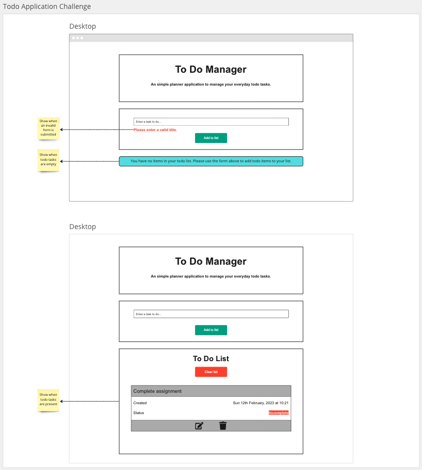
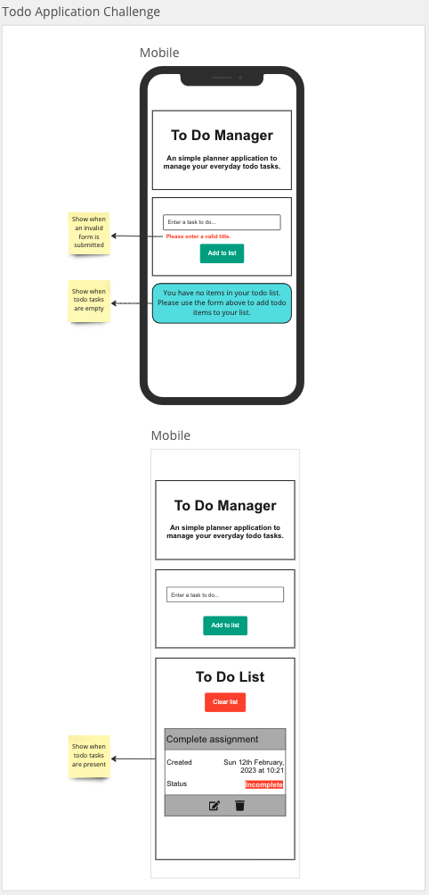

# Todo Application

## User Story

As a user I should be able to perform CRUD operations on a todo application.

## Acceptance Criteria

> Must contain a title "To Do Manager" and a sub-title of "A simple planner application to manage your everyday todo tasks."

> Must contain a form that has a text input with a place holder of "Enter a todo task" and a "Add to list" button

> On application load user must be presented with previously saved todo items from local storage. If there are no items then user must see an alert "You have no items in your todo list. Please use the form above to add todo items to your list."

> If there are previously stored items in local storage then the user must see a list of todo items along with a title of "Todo List" underneath the form

> When the user enter a todo task in the form and click on the "Add to list" button then the todo item must be stored in local storage and then todo list under the form should also present the newly added todo task

> When the user tries to submit an empty form then the user must see an error message underneath the form form input "Please enter a valid todo task"

> The todo item created will have a default status of incomplete and a creation date time in the format: 25th January, 2023 at 15:25

> Each todo item card will contain the todo task, status and created date and time fields

```javascript
{
  title: "Pick up car from garage",
  status: "INCOMPLETE",
  created: "25th January, 2023 at 15:25"
}
```

> Each todo task must have 2 control buttons: edit and delete button

> User must be able to delete a specific todo item by clicking on the delete icon in the todo card which will also clear the todo item from local storage

> User must be able to edit the title of a todo item by clicking on the edit icon in the todo card which will bring a modal with the specific todo title and status

> When the user updates the todo item's title and/or status and clicks on save the todo item will be updated in local storage and in the todo list

> When the user clicks on cancel or close in the modal the todo item will remain unchanged

> When the user clicks on the "Clear list" button then all the todo tasks will be cleared from local storage and the page

## Design Guide





## Getting Started

1. > Navigate to your `coding_bootcamp` workspace:

```
cd ~/coding_bootcamp
```

2. > Create a react project using the `create-react-app` script and use your own app name:

```
npx create-react-app your-app-name
cd your-react-app
```

3. > Create a repository in [GitHub](https://github.com/new) and enter the "Repository name" as the same name as your react app.

4. > In the terminal within your react app enter the commands provided by GitHub. The first command points your local repository to the remote GitHub, the second command sets your branch as `main` and the last command pushes all your local changes to the remote repository

```
git remote add origin git@github.com:YOUR_GITHUB_USERNAME/your-app-name.git
git branch -M main
git push -u origin main
```

5. > Once you refresh your GitHub page on the web browser you will see all your local files in GitHub.

6. > You can now proceed to work locally and add commit and push code regularly during development

## Resources

- CSS framework: [Bootstrap 5](https://getbootstrap.com/docs/5.3/getting-started/introduction/)
- Colour palette: [coolors](https://coolors.co/)
- Icons: [font-awesome icons](https://fontawesome.com/icons) | [CDN](https://cdnjs.com/libraries/font-awesome)
- [React docs](https://beta.reactjs.org/)
